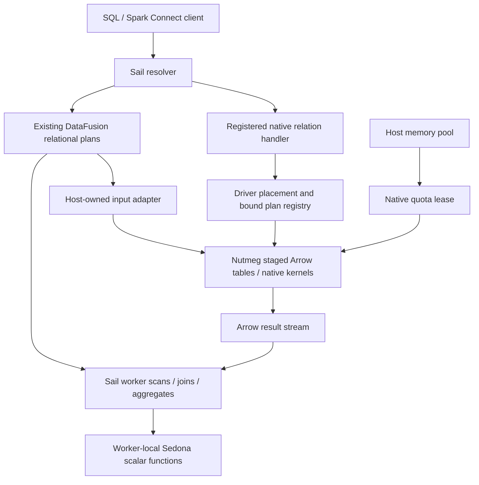

# Sail extensions: design, implementation, and validation

Start with the [Sail Extensions review request](SAIL-EXTENSIONS-REVIEW-REQUEST.md)
for the current review routes, checkout choices and feedback scope. This document
retains the combined prototype's architecture and historical qualification.
The separate static-preflight candidate checks declarations before entry-point
loading; it has its own source pin and test results in the review request. That
candidate does not change the runtime on the `sail-extensions` review branch.

## Purpose and review structure

This document describes an experimental contract for trusted native extensions in Sail, its
implementation with Apache SedonaDB and Nutmeg, and the evidence used to validate it. Spatial
and graph implementations remain outside Sail engine crates. Ordinary relational graph queries
use Sail's existing DataFusion plans; native graph kernels require explicit staging and
resource admission.

The design separates domain behavior from host responsibilities: protocol validation,
registration, distributed identity, field metadata, execution placement, retry policy, memory
ownership and teardown. Each responsibility has a concrete consumer, a stated invariant and
focused acceptance tests. This separation makes failures attributable to a specific boundary
and allows changes to be reviewed without reading the domain implementations at the same time.

The responsibilities are not all required by every extension. Distributed scalars
need registration, compatibility, identity, metadata and lifetime contracts.
Bounded relation dispatch and driver-native placement/retry rules serve the
additional stateful relation path demonstrated by Nutmeg.

The document proceeds from delivered behavior and execution paths to host contracts, review
units and their dependencies, then exact-revision test results, reproduction procedures and
unresolved design choices. The branch contains the combined implementation, example packages,
vendored source and test infrastructure. The review units describe a logical decomposition;
independently extracted and validated change sets have not yet been produced.

The current resource-domain implementation and compatibility results are included here. The
[follow-up record](review-follow-up.md) retains their detailed chronology; the
[machine-readable matrix](compatibility-matrix.json) and [evidence
bundle](evidence/extension-review-evidence.tar.gz) provide artifact-level provenance.

## Review boundary and provenance

The implementation has two qualified source revisions on `querygraph/sail`, branch
`work/extensions-datafusion-graphs`:

- [`de8e67098`](https://github.com/querygraph/sail/commit/de8e670989edb8ed5343764c52d0d002b6b6cd63)
  contains the integrated Sedona/Nutmeg proof of concept, direct graph relations,
  resource leases, geometry corrections and lifecycle changes. Its full platform
  gates and two-host result are scoped to this revision.
- [`bf97367dd`](https://github.com/querygraph/sail/commit/bf97367dd231de2535ad9b04b415fd2619bc4696)
  replaces implicit pool sharing with explicit resource domains in eight
  `sail-session` files. It has targeted Rust gates and unchanged-wheel integration
  qualification on macOS and Linux. Native package source, lease ABI and dependency
  pins are unchanged between these revisions.

The upstream baseline is `a85d912d72ae03a6d97b6a3fd151f5752da636c6`. Its diff to `de8e67098`
is 148 files, 30,210 inserted lines and 197 deleted lines, including tests, vendored source
and lockfiles:

| Area | Files | Insertions | Deletions |
| --- | ---: | ---: | ---: |
| Host crates | 68 | 4,865 | 115 |
| Example extensions, clients, vendor and harness | 73 | 24,079 | 0 |
| Development documentation | 5 | 1,092 | 0 |
| Root build files | 2 | 174 | 82 |

These historical counts distinguish engine work from package and harness volume; they are not
a size estimate for the individual review units below. Documentation revisions do not extend
an executable gate verdict to another source commit. This document records existing evidence
rather than a new execution test run.

The [implementation plan](implementation-plan.md), [original
review](implementation-review.md), [correction record](implementation-review-resolution.md)
and [graph follow-up plan](datafusion-graph-plan.md) retain earlier design and failure
analysis. Current behavior and qualification boundaries are stated below.

## What was built

| Surface | Delivered behavior | Boundary |
| --- | --- | --- |
| Native package bootstrap | Opt-in Python entry points load separately built native wheels; manifests, names, aliases and relation URLs are checked | Trusted installed code; compatibility qualified for listed artifacts |
| SedonaDB | 128 exported native/GEOS scalar functions plus aliases; SQL and Connect expression composition | Registration count is not exhaustive semantic qualification of every function |
| Distributed scalar execution | Worker loading, package identity checks and expression serialization | Required package must already be deployed on every worker |
| Geometry composition | Compatible WKB field metadata survives selected expressions, arrays and shuffles | Not universal propagation for every expression or client geometry UDT |
| Nutmeg graph tables | Degree, triplet and bounded-walk helpers produce ordinary relational plans | No native extension, CSR or new engine operator required |
| Native graph relations | Explicit stage, algorithm, scan, status and drop operations through Connect relation extensions | Graph state and native kernels remain driver-resident |
| Native memory | Host-funded quota, admission before expansion, shared CSR cache and retained-output ownership | Non-spillable, coarse reservation; not a process RSS ceiling |
| Lifecycle | Interrupt, early consumer termination, session deletion/expiry and graceful shutdown coverage | Synchronous initial CSR construction and final staging sort are not preemptible |
| Deployment | Repaired GEOS wheels, macOS/Linux gates and a real two-host functional run | No general Kubernetes or arbitrary mixed-architecture qualification |

The independent extension workspaces live under
[`examples/extensions`](../../../examples/extensions/README.md). Sedona source is pinned at
`0a1993d9be8bcf52150593ad08fc6a3412d50f29`; Nutmeg/Grust vendor provenance is pinned at
`f267b03659dd536981f98420944f911b667632b7`. Host and wheels use DataFusion 55.1.0, Arrow
59.3.0 and PyO3 0.29.0. Sedona has no Sail crate dependency. Nutmeg shares only the
dependency-free resource-lease ABI crate, not a Sail engine crate.

### Execution architecture



There is no second DataFusion engine or out-of-process Nutmeg service in this architecture.
CSR is an adjacency representation built for native algorithms. An ordinary relational graph
query stays in Sail's existing optimizer and scheduler. A native region is opaque to the host
optimizer; visible input and output relations still compose with normal Sail operators.

### Sedona: reuse native functions without importing a spatial engine

The extension imports actual SedonaDB Rust/GEOS scalar functions through DataFusion FFI.
Representative construction, text conversion, predicates, distance, area, null handling,
aliases and composition are tested. Ordinary Sail joins can evaluate spatial predicates. No
indexed `SpatialJoinExec`, spatial optimizer rule, raster surface or complete Spark Sedona
implementation was built.

Five colliding names are deliberately excluded: `st_asbinary`, `st_geomfromwkb`,
`st_geogfromwkb`, `st_setsrid`, and `st_srid`. Sail retains its first three implementations
and the latter two existing placeholders. The extension does not make those placeholders
functional or replace builtin semantics silently.

Geometry uses GeoArrow WKB field metadata. The correction preserves compatible fields through
native/builtin nesting, CASE, coalesce, array construction and indexing, including distributed
serialization. Incompatible ordinary binary, geography and CRS combinations are rejected. This
is a typed-field correctness requirement; copying arbitrary metadata from an arbitrary child
would be wrong.

The pinned Sedona source needed a DataFusion 54/Arrow 58 to 55/59 compatibility port. Only the
scalar-required surface was qualified. Wheels bundle GEOS and have their native dependency
closure audited; macOS minimum-version tags reflect the actual bundled dependencies. This is
not a claim of universal wheel portability.

### Nutmeg: relational first, native kernels by explicit choice

```python
from sail_nutmeg import Nutmeg

nm = Nutmeg(spark)
g = nm.tables("nodes", "edges").validate()
g.degrees().show()          # ordinary Sail joins and aggregates
ng = g.walks(2)             # bounded walks, preserving edge multiplicity
ng.show()
nm.stage("snapshot", g.nodes, g.edges)  # explicit native capture
nm.nodes("snapshot").show()           # staged Arrow scan, no CSR
nm.run("snapshot", "pagerank").show() # explicit driver-native algorithm
nm.drop("snapshot")
```

The [GraphTables helper](../../../examples/extensions/nutmeg/python/sail_nutmeg/graph.py)
accepts table names or DataFrames. It preserves ordinary ID/property types and normal
execution-time table consistency. Validation checks unique non-null nodes and valid endpoints.
Degree results include isolates; duplicate edges and loops retain their multiplicity. Walks
may revisit vertices and edges: closed walks are not counts of deduplicated triangles or
simple cycles. This path works with native extensions disabled and needs no Sail
graph-specific change.

Staging consumes all input partitions, including empty partitions. Normalization uses UTF8
identifiers and `property.*`/`present.*` fields; staged scans are not a lossless round trip of
every original table type. Explicit nodes define the node set. Failed staging leaves the
previously published graph intact. The Python stage/drop helpers consume receipts eagerly;
provider planning itself does not publish or delete state.

Each native reader pins a published entry. Overwrite/drop does not invalidate existing
readers. Independent algorithm readers share a synchronized CSR cache per entry and projection
options. Displayed revision numbers restart after recreation, so cache identity is not just
graph name plus revision number. Separately resolved node and edge scans do not promise one
common revision across concurrent replacement; the Rust snapshot API can pin both together.
There is no automatic CSR eviction or dynamic quota lending.

Native results can feed downstream distributed SQL. This does **not** distribute the native
CSR kernel itself. Distributed iterative graph algorithms need a separate design for
partitioned state, round exchanges, convergence, deterministic reductions and recovery. The
distributed SQL tests do not establish those iterative execution contracts.

## Necessary host contracts and their justification

### 1. A bounded relation entry point

The Connect envelope carries a payload type URL, opaque payload and ordinary Connect input
plans. Sail validates version, size, arity and registration before planning children. Input
expressions are currently rejected explicitly. Limits are 8 MiB per envelope, 1 MiB payload,
16 inputs, 512-byte type URLs and nesting depth 64. Registered input-free handlers may opt
into a bare Any payload.

The host must own parsing and dispatch because it owns the Connect protocol and child-plan
resolver. Plugins own payload interpretation and domain semantics. Planning and EXPLAIN must
be free of mutations. A relation handler produces a DataFusion provider from resolved physical
inputs; no Nutmeg payload types enter Sail core.

Source: [wire validation](../../../crates/sail-spark-connect/src/proto/extension/wire.rs),
[conversion](../../../crates/sail-spark-connect/src/proto/extension.rs),
[resolver](../../../crates/sail-plan/src/resolver/query/extension.rs), and [handler
contract](../../../crates/sail-common-datafusion/src/connect_extension.rs). The
conversion-depth guard crosses separately decoded Any messages; stack growth also touches
ordinary conversion. Its bounds, `stacker` dependency and effect on ordinary plans form a
separate parser review unit with dedicated regressions.

### 2. Trusted registration and explicit compatibility

The [session loader](../../../crates/sail-session/src/extensions/mod.rs) uses
`pysail.extensions` entry points behind `SAIL_EXPERIMENTAL_EXTENSIONS=1`. The
[manifest](../../../crates/sail-session/src/extensions/manifest.rs) declares version,
placement, relation bounds and optional native quota. Duplicate names, aliases and URLs fail;
ordinary catalog precedence remains intact.

The loader belongs in the Python-capable session layer. Host-facing contracts belong below it,
so the execution layer does not acquire a Python discovery API. Per-session bound state is
separate from process-retained library/module code. Code must remain loaded while native
callbacks or arrays can still refer to it. Hot unloading is not qualified.

The native boundary uses named DataFusion capsules for scalar UDFs, providers and execution
plans. Rust host traits do not become a cross-library ABI. Version checks and content hashes
reject known mismatches; they neither sandbox native code nor prove all possible ABI
compatibility. The original qualification used pinned host/wheel builds. The manifest checks
API/DataFusion/Arrow versions, not Sail commit or Rust compiler identity. Unchanged
platform-specific wheel bytes passed the original host-revision matrix and the
[expanded ABI experiments](abi-review.md). Loader acceptance, tested artifact combinations
and a compatibility promise remain distinct. Cross-compiler reuse and mixed-compiler
process workers are qualified only for the recorded artifact pairs; no general ABI range
or mixed engine-version cluster is qualified.

### 3. Worker identity and complete expression fields

A scalar that works only in the driver is insufficient for distributed Sail. The [native
expression codec](../../../crates/sail-execution/src/proto/native_expr.rs) serializes
ownership/identity and metadata-bearing return fields. Workers resolve the installed function
and reject missing or different packages. Bundled native libraries participate in package
identity. Raw function pointers are never sent between processes.

Builtin metadata-bearing expressions must retain their fields too; native-only handling failed
when WKB passed through a Sail builtin before another native call. This is why the correction
extends beyond the extension wrapper. The host owns its plan codec and therefore must enforce
this invariant. Package distribution itself stays an operator/deployment responsibility.

### 4. A host-owned input adapter

The [host input adapter](../../../crates/sail-common-datafusion/src/connect_extension.rs)
retains the actual Sail task context and Tokio runtime while executing every input partition.
This avoids substituting a reconstructed foreign RuntimeEnv that loses host memory/spill
policy. It also allows distributed shuffle inputs to be bound when the driver region is
materialized.

The plugin receives data and schemas through DataFusion FFI, not access to Sail's scheduler
internals. Input field names and result naming follow Sail resolution. Tests exercise memory
pressure and disabled/exhausted spill policies through the actual adapter. The bridge gathers
input into one host partition; it is not a general contract for sorted or co-partitioned
foreign inputs, nor does it propagate every host service to arbitrary foreign operators.
Native CSR allocations do not acquire spill support through this adapter.

### 5. Explicit driver placement and conservative retry behavior

[DriverExtensionExec](../../../crates/sail-common-datafusion/src/driver_extension.rs) is a
generic placement boundary. Session-owned bound plans are referenced by owner/plan
identifiers; decoding checks ownership, liveness, arity and schema. Workers cannot decode a
driver-local handle. The registry uses weak entries and job completion releases bindings; it
is not a durable graph object store.

The scheduler gives a region containing driver-native execution one attempt. This includes
reads, conservatively. Replaying a stage/drop after publication but before receipt could
repeat a mutation. An unacknowledged mutation is reported as indeterminate; the implementation
does not provide cross-request exactly-once semantics. Retaining the same bound plan also
preserves its pinned graph revision and mutation attempt across child replacement.

Placement belongs in Sail because only Sail decides where a region runs. Replay policy belongs
there because only the scheduler can prevent automatic replay. These protections are part of
the stateful relation contract. Driver-only scalar exports are rejected; general driver-scalar
scheduling is not implemented. The current boundary does not introduce a general transaction
or effect system.

### 6. Host-funded native ownership

The [resource bridge](../../../crates/sail-common-datafusion/src/native_resource.rs) reserves
a native session quota up front from the actual DataFusion pool. Nutmeg subdivides that
prepaid allowance; its default is 256 MiB. The dependency-free [ABI
crate](../../../crates/sail-native-resource-ffi/src/lib.rs) carries version, size, byte count,
an opaque owner and retain/release callbacks. It does not expose Rust `Arc` or trait-object
layout across independently compiled libraries.

Native state, snapshots, producers and exported Arrow buffers retain the lease until their
last owner disappears. Admission precedes ID expansion, missing-field construction, sorting
and canonical copies. Concurrent readers share derived CSR rather than charging/building
independent copies of one published entry.

With a finite pool, participating host/native reservations compete for admission. An unbounded
pool stays unbounded. Native reservations are non-spillable and reserve idle capacity.
Runtime/Python/transport allocations, Rust metadata and a fixed 16 MiB per-library
schema-probe store need separate headroom. Arrow rows, CSR, scratch and output may coexist.
This is not an RSS limit.

The [memory resource domain](../../../crates/sail-session/src/runtime/memory.rs) is explicitly
owned. With experimental extensions enabled, a session manager creates one domain and injects
it into its sessions and in-process workers. Cloning a domain shares its pool; constructing
another domain creates independent admission even with identical configuration. An
independently started worker factory owns its own domain. Without an injected domain, runtime
environments retain separate pools. This replaces the earlier process-wide configuration-keyed
registry.

The manager is an admission boundary, not a tenant security boundary. Its users compete for
the same finite pool. Embedders can deliberately share a domain across managers; custom
factories and runtime mutators are responsible for honoring the injected ownership policy. The
domain change adds no wire field or native ABI. Its tests cover Greedy/Fair contention,
isolation with equal settings, retained leases and pool identity through actual runtime
factories.

In-process execution alone does not make native allocations visible to host admission. Nutmeg
runs inside Sail but still requires explicit accounting and buffer ownership. Sharing a JVM
heap similarly does not define an extension's reservation, spill or cancellation contract.
Existing relational operators supply these host execution paths directly; native kernels use
the resource bridge.

### 7. Teardown is part of correctness

The work exposed host lifecycle defects as well as extension-specific ownership problems.
[Executor interruption](../../../crates/sail-spark-connect/src/executor.rs) now keeps a
lightweight terminal identity for client reattachment while releasing streams and buffers; a
concurrent pause cannot resurrect cancelled execution. Session lifecycle hooks drain executors
and reject plans completing after stop.

The [Python owner](../../../crates/sail-session/src/extensions/python_owner.rs) acquires the
GIL for final destruction. Otherwise PyO3's deferred decref could retain a native quota until
an unrelated later Python request. A separate native resource tracker waits for actual final
lease release without owning the leases. [Cleanup
tasks](../../../crates/sail-session/src/session_manager/cleanup.rs) are drained at shutdown
even after deletion/expiry removed the active session.

These lifecycle corrections are independently reviewable and are not all conditional on the
extension flag. A bounded shutdown policy for a noncooperative trusted plugin remains
unresolved. Waiting for ownership preserves accounting, but indefinite waiting is an
operational risk. A timeout may report failure or terminate a process; it must not release
accounting while live native owners can still allocate/use buffers. No general isolation
mechanism was built.

## Package boundaries and dependencies

Domain libraries, graph schemas and client helpers belong to the independent extension
packages. Sail owns the execution and resource contracts that only the host can enforce.
Packaging and deployment tooling validates those contracts at installation and process
boundaries.

- Sedona/GEOS, Nutmeg algorithms, vendored source and Python graph helpers reside
  in independently built package/example workspaces.
- Wheel repair, native dependency audits and deployment inventories reside in
  the package workflow. Sail validates installed identity; it does not distribute
  or install packages on workers.
- The optional external worker launcher is operational infrastructure. It uses
  validated JSON argv without shell evaluation and an SSH heartbeat lease.
- Kubernetes flag propagation is present, but Kubernetes deployment is unqualified.
- Lifecycle and geometry correctness have separate review units because their
  invariants apply beyond native package registration.
- Optimizer hooks, indexed spatial joins, distributed native graph iteration and
  dynamic quota lending are outside the implemented contract.

DataFusion was already 55.1.0 at the upstream baseline. The branch pins its constraints
exactly and adds `datafusion-ffi`; it does not upgrade DataFusion. Arrow/Parquet manifest
constraints change from 59.2.0 to exact 59.3.0. These changes align host and extension FFI
builds. Dependency alignment is distinguishable from the domain packages' own compatibility
ports.

## Review units and validation dependencies

The following units organize the combined implementation around independently assessable
invariants. Each unit links its responsibility to observable acceptance criteria. The order
exposes generic correctness first, then local extension execution, distribution, stateful
relations and deployment. These are review boundaries within the existing implementation, not
separately landed changes.

| Review unit | Responsibility and rationale | Acceptance criteria |
| --- | --- | --- |
| 1. Lifecycle | Terminal interruption, no resurrection, deletion/expiry cleanup and shutdown ordering preserve ownership independently of extension registration | Deterministic executor/cleanup tests; client reattachment and stop regressions |
| 2. Field correctness | Compatible geometry fields survive expressions and plan serialization | Native/builtin composition, NULL, scalar-list broadcast, empty arrays and shuffles |
| 3. Scalar bootstrap | FFI alignment, manifest/name validation and native owner retention permit external scalar registration | Flag-off behavior, mismatch/collision rejection, owner lifetime and local scalar execution |
| 4. Distributed scalars | Worker registration and identity-aware codecs reproduce scalar behavior outside the driver | Missing/mismatched worker package rejection and process-worker geometry composition |
| 5a. Parser bounds | Conversion depth and stack growth protect Connect parsing, including ordinary conversion paths | Malformed, oversized and nested inputs; depth limits and ordinary-plan regressions |
| 5b. Relation dispatch | Registered payloads resolve ordinary children without planning-time mutation; the adapter preserves host input policies | Arity rejection before child planning, all partitions, EXPLAIN purity and memory/spill policy checks |
| 6. Native resources | Explicit resource domains, quota leases and final-owner tracking connect native state to host admission | Equal-configuration isolation, shared-domain contention, pre-allocation refusal and retained-output lifetime |
| 7. Driver-native execution | Placement, bound handles, one-attempt regions and job cleanup protect session-local state | Worker handle rejection, stale/foreign handle rejection, atomic stage and post-publication receipt failure |
| 8. Packaging and deployment | Repaired wheels, inventories and optional launchers establish artifact and process boundaries | Native dependency closure, matched identities, successful tasks on both hosts and cleanup |

The dependencies determine meaningful test combinations. Unit 4 requires unit 3 and the field
fidelity in unit 2. Stateful driver relations require both bounded relation dispatch (5a/5b)
and native ownership (6) before their placement and retry behavior (7) is complete. Resource
finalization also uses the lifecycle hooks in unit 1. Some source files span units, so file
boundaries alone do not define a correct decomposition. The graph-table helper is independent
of the native host contract and can be tested with extensions disabled.

A gate verdict identifies exactly the source revision and artifact combination that ran.
Extracted changes and their combined revision therefore require their own gates; passing
component tests do not establish that a different composition passes. Keeping the invariants,
dependencies and acceptance criteria explicit allows review and testing at each boundary
without treating the entire branch as one indivisible change.

## Evidence and what it establishes

At `de8e67098`, independent macOS arm64 and Linux x86_64 full extension gates passed in
detached source trees with private target directories. Each platform recorded:

- 651 Rust tests: 586 host library, 4 Sedona, 5 Nutmeg, 55 vendored graph unit and
  one isolated allocation-admission integration test; strict host clippy and formatting.
- 22 release stress runs: two fixtures, each once idle and ten times with all
  logical CPUs busy (10 on macOS, 36 in the Linux guest).
- Three Python client and five launcher/parser tests.
- Integration: local 64 passed/one expected worker-only skip, actor cluster 65
  passed, separate-process workers 65 passed: 194 passes per platform.

These are selected host/extension gates, not a claim that every Sail workspace feature or
every upstream Sedona function was tested. The isolated allocator regression rejects a
million-row expanding-ID input before expanded arrays are allocated; accepted
normalization/canonicalization stays within its admitted peak. Its measurements concern
allocation requests, not process RSS.

A separate real two-host run used identical x86_64 binary/wheel identities on Capitola
(Rosetta) and native Intel Morrobay. Morrobay completed 81 worker tasks, Capitola 70; 30
stages had successful tasks on both workers. It covered 17 Sedona geometries after shuffle,
relational degree/two-hop queries, spatial input to a five-node/four-edge native graph, native
results through shuffle, scans and drop. All task rows were retained; successful-task claims
use terminal task records. This qualifies cross-host execution, not native mixed-architecture
compatibility or performance. Driver and worker cleanup was verified.

Linux ran in Colima/QEMU on Morrobay with 36 visible CPUs, approximately 78.53 GiB guest RAM
and a 72 GiB no-swap container limit. The task environment was stopped after evidence
collection; the pre-existing default Colima profile was preserved. See the [environment
record](linux-environment.md) for reproduction and limitations.

Failed candidates remain evidence. `d7143e099` failed scalar-list geometry metadata and
geometry/NULL coercion checks. The fix preserved the assertions and corrected the subject.
Earlier review found allocation before admission, duplicate CSR construction, missing bundled
GEOS and incomplete lifecycle evidence; the [resolution
record](implementation-review-resolution.md) maps each to code and tests.

At `bf97367dd`, both platforms passed 35 session library tests, strict all-target session
clippy, workspace formatting and the Sail executable build. The same installed wheel pair
within each platform then ran against both host revisions:

| Platform / host revision | Local | Actor cluster | Process cluster |
| --- | --- | --- | --- |
| macOS arm64 / `de8e67098` | 64 passed, 1 skip | 65 passed | 65 passed |
| macOS arm64 / `bf97367dd` | 64 passed, 1 skip | 65 passed | 65 passed |
| Linux x86_64 / `de8e67098` | 64 passed, 1 skip | 65 passed | 65 passed |
| Linux x86_64 / `bf97367dd` | 64 passed, 1 skip | 65 passed | 65 passed |

This matrix contains 776 integration passes and four expected worker-only skips. Installed
wheel payloads and archive bytes were verified before and after testing; binary hashes
distinguish the two host builds. The runner and all ten executable Python fixture hashes match
across platforms. Seven Python harness tests also passed. Both host builds use Rust 1.97.1;
the result is not cross-compiler qualification.

The follow-up Linux envelope is separate: 24 visible CPUs, 67,414,478,848 bytes of guest RAM
and a 56 GiB no-swap container limit. Both sets of environment records are retained. The
targeted follow-up gates do not repeat the original 651-test Rust suites or two-host run.
Failed gate attempts, corrections and an evidence transfer recovery are documented in the
[follow-up record](review-follow-up.md).

A separate [ABI review](abi-review.md) extends the experiment to Rust 1.98.1, an
upstream Sail merge and an isolated older FFI implementation, while retaining the
original wheels. It also records strict refusal probes and a whole-engine downgrade
that fails to compile. Its [expanded matrix](abi-compatibility-matrix.json) and
[evidence bundle](evidence/extension-abi-evidence.tar.gz) preserve those distinct
outcomes. These are targeted compatibility experiments, not new full-workspace
or two-host qualification. Production dependency pins and manifest checks remain unchanged.

The original [machine-readable matrix](compatibility-matrix.json) identifies host binary and
platform-specific wheel hashes. The [evidence
bundle](evidence/extension-review-evidence.tar.gz) contains redacted receipts, logs, retained
failures and cleanup records from both qualification stages. It is available with the
repository. Original unredacted artifacts under `target/extensions-datafusion-final/` and
`target/extensions-review-followup/` remain local and are not part of a clone.

Not established: network acknowledgement-loss fault tolerance, abrupt process recovery,
arbitrary cancellation interleavings, Kubernetes operation, optimized spatial joins, full
native allocation/RSS accounting, portable binary ABI across Sail releases, distributed native
graph iteration or benchmark performance.

## Reproduction and evidence validation

Validation has three layers: focused contract regressions, execution-mode integration, and
artifact/provenance checks. The checked-in tools implement these layers separately so a
passing package build cannot be mistaken for a passing distributed execution test.

The [build script](../../../examples/extensions/scripts/build.sh) creates the host and
independent wheels from locked dependencies and repairs native library packaging. The
[verification script](../../../examples/extensions/scripts/verify.sh) requires a clean
detached worktree, uses its own target directory, runs formatting, Rust tests, clippy, native
tests, release stress fixtures and Python integration, and checks that HEAD and source
cleanliness did not change before issuing a verdict. Its environment overrides and
prerequisites are described in the [example guide](../../../examples/extensions/README.md) and
[Linux environment record](linux-environment.md).

The [compatibility runner](../../../examples/extensions/scripts/check_compatibility.py)
accepts a manifest of at least two host revisions with executable paths and expected SHA-256
values, plus the existing wheel archives. It performs no build or installation. Installed
package payloads must match those archives, and each host runs local, actor-cluster and
process-cluster tests. Receipts record commands, exit codes, logs, harness/test hashes and
before/after artifact checks. Source provenance comes from the corresponding build receipts; a
binary hash alone does not prove its source revision.

The [evidence exporter](../../../examples/extensions/scripts/package_review_evidence.py)
selects text records, retains failures and records both original and exported hashes.
Home-account paths, review hostnames and private network addresses are redacted. Executable
and wheel payloads are omitted; their recorded hashes remain. The [archive
checksum](evidence/extension-review-evidence.tar.gz.sha256) verifies the compressed download.
After extraction, member integrity is verified by:

```bash
shasum -a 256 -c SHA256SUMS
```

`manifest.json` lists the exported paths, redactions and exclusions. The bundle's `original/`
and `follow-up/` directories separate the two qualification stages. Historical absolute paths
in receipts are provenance, not portable file links. Failures, expected skips and unqualified
execution classes remain distinct from successful results.

## Open design choices

The implementation makes the following policies explicit while leaving their long-term
generalization open:

- **Compatibility evolution.** The artifact matrix establishes bounded wheel
  reuse. Broader release independence requires an explicit compatibility-version
  policy and additional unchanged-wheel tests. Stable ABI ranges and hot unloading
  are not part of the current contract.
- **Relation boundary.** The implemented envelope supports pure planning and
  ordinary child plans. General optimizer hooks, arbitrary foreign input
  requirements and complete foreign-service propagation remain separate designs.
- **Admission scope.** The default domain is a session manager, with explicit
  sharing available to embedders and separate domains for process workers.
  Per-tenant admission and scheduling policy are not specified.
- **State and replay.** Driver-native regions receive one attempt, including
  reads. Durable state recovery, cross-request exactly-once behavior and a finer
  distinction between replay-safe reads and mutations are not implemented.
- **Shutdown.** Final-owner accounting is implemented. The deadline and failure
  policy for a noncooperative native owner remains unresolved; releasing its
  reservation while live owners remain would violate the ownership contract.
- **Field semantics.** Compatible geometry propagation is implemented for the
  tested expressions. A general metadata contract shared with DataFusion would
  need to define behavior for additional expressions and extension types.
